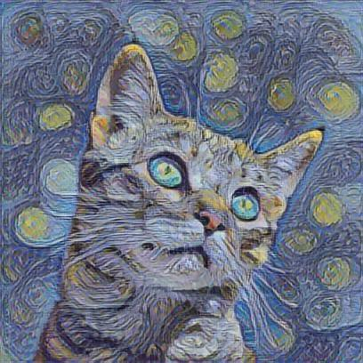
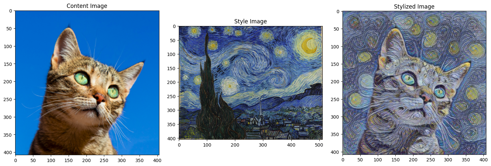

# Neural Style Transfer

*COMPANY*: CODTECH IT SOLUTIONS

*NAME*: PALADUGU VISHNU VARDHAN

*INTERN ID*: CODF32

*DOMAIN*: ARTIFICIAL INTELLIGENCE 

*DURATION*: 4 WEEEKS

*MENTOR*: NEELA SANTOSH KUMAR

<div align="center">
  
</div>


## 📋 Table of Contents

- [About the Project](#about-the-project)
- [Features](#features)
- [Getting Started](#getting-started)
  - [Prerequisites](#prerequisites)
  - [Installation](#installation)
- [Usage](#usage)
- [Results](#results)

## 🎨 About the Project

This project implements neural style transfer using TensorFlow Hub. It applies the artistic style from one image to the content of another image, creating stunning artistic renditions of photographs.


## ✨ Features

- **Fast Style Transfer** - Achieve style transfer in seconds using Google's pre-trained models
- **No Training Required** - Utilizes TensorFlow Hub's ready-to-use models
- **High Compatibility** - Handles various image formats and sizes
- **Quality Results** - Produces high-quality stylized images with excellent detail preservation
- **Easy to Use** - Simple API with minimal configuration needed

## 🚀 Getting Started

### Prerequisites

- Python 3.6 or higher
- Jupyter Notebook or JupyterLab

### Installation

1. Clone the repository:
   ```bash
   git clone https://github.com/Ver-er/Neural-Style-Transfer.git
   cd Neural-Style-Transfer
   ```

2. Install the required packages:
   ```bash
   pip install tensorflow tensorflow-hub pillow matplotlib numpy
   ```

3. Prepare your images:
   - Place your content image as `content.jpg` in the project directory
   - Place your style image as `style.jpg` in the project directory

## 💻 Usage

1. Launch Jupyter Notebook:
   ```bash
   jupyter notebook
   ```
   or
   ```bash
   jupyter lab
   ```

2. Open and run `neural_style_transfer.ipynb`

3. The styled image will be saved as `stylized_tf_hub.jpg` in the project directory

## 📈 Results

The TensorFlow Hub implementation automatically balances content preservation and style transfer, providing excellent results with minimal configuration.

<div align="center">
  
  <p><em>Example of style transfer: content image (left), style image (center), result (right)</em></p>
</div>

---
